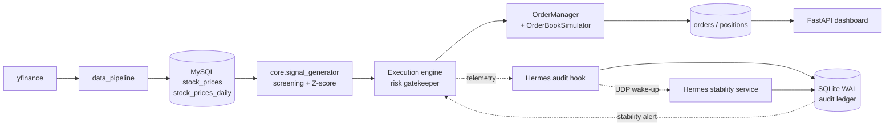

# alpha-quant

**Production-grade statistical arbitrage & pairs trading engine.**

`alpha-quant` screens an equity universe for cointegrated pairs, estimates time-varying hedge ratios with a causal Kalman filter, standardizes the resulting spread into a Z-score, and routes signals through a portfolio risk gatekeeper into a deterministic paper-trading engine. Every order lifecycle transition and every stability alert is written to an independent audit trail.

> **Disclaimer.** This project is for research and educational purposes only and is not investment advice. All execution is simulated (paper trading); no orders are sent to a broker and no capital is deployed. Historical simulation results do not predict future performance.

---

## Table of Contents

1. [Mathematical & Statistical Framework](#1-mathematical--statistical-framework)
2. [System Architecture](#2-system-architecture)
3. [Installation & Quickstart](#3-installation--quickstart)
4. [Testing & Verification](#4-testing--verification)
5. [Configuration Reference](#5-configuration-reference)
6. [Scope, Assumptions & Known Limitations](#6-scope-assumptions--known-limitations)
7. [Repository Layout](#7-repository-layout)
8. [Security Notes](#8-security-notes)
9. [License](#9-license)

---

## 1. Mathematical & Statistical Framework

Let $A_t$ and $B_t$ denote the (adjusted) close prices of two assets on a synchronized calendar.

### 1.1 Cointegration: Engle–Granger two-step procedure

Two price series that are individually $I(1)$ are cointegrated if some linear combination is $I(0)$.

**Step 1 — static hedge regression (OLS):**

$$
A_t = \alpha + \beta B_t + u_t, \qquad \hat{s}_t = A_t - \hat{\alpha} - \hat{\beta} B_t
$$

**Step 2 — stationarity test on the residual spread.** An augmented Dickey–Fuller-type test is applied to $\hat{s}_t$ with MacKinnon cointegration critical values (implemented with `statsmodels.tsa.stattools.coint`, constant trend, AIC lag selection):

$$
H_0:\ \hat{s}_t \text{ has a unit root (no cointegration)} \qquad\text{vs.}\qquad H_1:\ \hat{s}_t \sim I(0)
$$

A pair is eligible only when $p < 0.05$ (`PairTradingConfig.max_pvalue`). Fits with $\hat{\beta} \le 0$, a degenerate spread variance, or collinear inputs are rejected.

Additional gates applied by the live screener (`core/signal_generator.py`) and by the Hermes stability monitor:

| Gate | Threshold | Purpose |
| :--- | :--- | :--- |
| Engle–Granger $p$-value | $\le 0.05$ | Cointegration |
| ADF $p$-value on the spread (Hermes) | $\le 0.05$ | Spread stationarity |
| Ornstein–Uhlenbeck half-life | $\le 20$ sessions | Reversion speed |
| Hurst exponent | $\le 0.45$ | Mean-reverting persistence |
| Hermes minimum sample | $\ge 200$ observations | Statistical power |

### 1.2 State-space model & causal Kalman filter (dynamic hedge ratio $\beta_t$)

The static OLS hedge ratio is replaced, in Kalman mode (`strategies/kalman_pair.py`), by a time-varying relationship estimated with the `statsmodels` `KalmanFilter`. Prices are normalized once by their first observation, $a_t = A_t/A_0$ and $b_t = B_t/B_0$. The latent state $\theta_t = [\alpha_t,\ \beta_t]^\top$ follows a random walk:

$$
\theta_t = \theta_{t-1} + \eta_t, \qquad \eta_t \sim \mathcal{N}(0, Q)
$$

$$
a_t = \begin{bmatrix} 1 & b_t \end{bmatrix} \theta_t + \varepsilon_t, \qquad \varepsilon_t \sim \mathcal{N}(0, R)
$$

| Parameter | Value |
| :--- | :--- |
| $Q$ | $\mathrm{diag}(10^{-7},\ 10^{-6})$ |
| $R$ | $10^{-4}$ |
| $\theta_0$, $P_0$ | $[0,\ 1]^\top$, $\mathrm{diag}(0.01,\ 0.01)$ |

The variances are fixed before any backtest and are **not** tuned on results.

**Causality.** Only the forward filter is used; there is no smoothing, no full-sample normalization, and no parameter optimization. The trading residual is the one-step-ahead prediction error (innovation), computed *before* the current $A_t$ is assimilated:

$$
e_t = a_t - \alpha_{t|t-1} - \beta_{t|t-1}\, b_t, \qquad \beta_t^{\text{raw}} = \beta_{t|t-1}\,\frac{A_0}{B_0}
$$

Prefix-invariance tests assert that appending or altering later data can never change an earlier prediction or signal.

### 1.3 Residual dynamics: exponentially weighted OU fit and Z-score

The innovations are modeled as a discretized Ornstein–Uhlenbeck process, estimated as a weighted AR(1) on *past* innovations only (weights $0.98^{\text{age}}$, at least 30 observations, first 20 innovations discarded as filter burn-in):

$$
e_t = c + \varphi\, e_{t-1} + \xi_t
$$

$$
\kappa = -\ln\varphi, \qquad \mu = \frac{c}{1-\varphi}, \qquad t_{1/2} = \frac{\ln 2}{\kappa}, \qquad \sigma_{eq} = \sqrt{\frac{\sigma_\xi^2}{1-\varphi^2}}
$$

Fits with $\varphi \ge 1$ (non-stationary) or $\varphi \le 0$ (oscillatory) are rejected, not clipped.

**Z-score.**

$$
Z_t = \frac{e_t - \mu}{\sigma_{eq}}
$$

In the static Engle–Granger path the same idea is applied to the OLS residual: $Z_t = (s_t - \bar{s}) / \hat{\sigma}_s$ with $\bar{s}$ and $\hat{\sigma}_s$ (sample standard deviation, $ddof=1$) taken from the fit window.

### 1.4 Signals and dynamic risk thresholds

| Rule | Condition |
| :--- | :--- |
| Short spread (sell A, buy $\beta$·B) | $Z_t > 2$ |
| Long spread (buy A, sell $\beta$·B) | $Z_t < -2$ |
| Mean-reversion exit | long spread: $Z_t \ge 0$; short spread: $Z_t \le 0$ |
| Kalman entry filter | valid OU fit, $\beta_t^{\text{raw}} > 0$, $3 < t_{1/2} < 25$ sessions, $\ge 60$ synchronized sessions |
| Research risk exits | $\lvert Z_t\rvert > 3.5$ (structural-break stop) or a 45-session time stop |
| Live per-trade stop | net position loss $\le -1\%$ of portfolio equity (`RiskConfig.MAX_RISK_PER_TRADE`) |

Entry boundaries are strict (exactly $\lvert Z\rvert = 2$ does not qualify). In Kalman mode the OU half-life gate replaces the Engle–Granger entry gate; it is not an additional cointegration claim. Quantities are fixed at entry from the signal-close $\beta$ and are not rebalanced while the position is open.

Detailed derivations, accounting rules and generated results are in [`research/KALMAN_MODEL.md`](research/KALMAN_MODEL.md), [`research/PAIR_BACKTEST.md`](research/PAIR_BACKTEST.md), [`research/PORTFOLIO_ENGINE.md`](research/PORTFOLIO_ENGINE.md) and [`research/SECTOR_SCREENING.md`](research/SECTOR_SCREENING.md).

---

## 2. System Architecture



### 2.1 Core & Analytics (`core/`)

- `signal_generator.py` builds the synchronized price matrix from the database, applies the screening gates of §1.1 (`ScreenerConfig`: $p \le 0.05$, half-life $\le 20$, Hurst $\le 0.45$) and returns ranked candidates with their current Z-score.
- `analytics.py` computes closed-trade performance metrics from the position ledger.
- `health_score.py` provides an optional 0–100 fundamental health overlay.
- `strategies/` contains the database-free strategy models: `pair_trading.py` (Engle–Granger/OLS), `kalman_pair.py` (Kalman + OU) and `mean_reversion.py` (half-life and Hurst estimators).

### 2.2 Execution & Ledgers (`execution/`)

- **Paper-trading cycle.** Each worker cycle (`WORKER_CYCLE_SECONDS`, default 180 s) scans opportunities, evaluates exits for open positions, and submits new pair orders that pass the gatekeeper.
- **Gatekeeper limits** (`config/risk_config.py`): max 5 open positions, 2% daily loss limit, 15% portfolio drawdown limit, 10% max position weight, 20% max exposure per asset, 40% max strategy exposure, 4-hour cooldown after a close. The engine additionally refuses to trade on prices older than `MAX_PRICE_AGE_DAYS`. `TRANSACTION_COST_RATE` (0.15%) is used by the pair backtester.
- **Order simulation.** `OrderBookSimulator` is a pure, deterministic market-order fill model: 10% bar-volume participation cap, liquidity penalty, gap rejection above 500 bps, and configurable commission (10 bps), slippage (5 bps) and short-borrow (3% p.a.) costs. Pair orders preserve the hedge: a partial fill on one leg cannot leave an unhedged residual.
- **`OrderLedger`** appends every lifecycle transition (`order_id`, `pair`, `leg_symbol`, `side`, `target_shares`, `limit_price`, `status`, `rejection_reason`) to the `orders` table and creates that table on first use. Ledger failures are isolated and cannot halt execution.
- **Per-leg position tracking.** `position_ledger.py` persists one `positions` row per filled leg (symbol, side, quantity, entry/current price, stop and take-profit prices, unrealized PnL, status, open/close timestamps); a pair is two rows sharing a `strategy_name`. Opens are written inside the caller's transaction; closes record the final leg PnL.

### 2.3 Risk & Telemetry — Hermes (`hermes/`)

Hermes is an **isolated audit and shadow-monitoring subsystem**. It runs off the trading path and can only influence execution by publishing an alert.

- **Independent audit logger.** `audit_ledger.py` is a local SQLite database in WAL mode with its own connection, independent of SQLAlchemy and of the trading database. The default location is `%LOCALAPPDATA%\AlphaQuantBot\hermes_audit.db` on Windows and `$XDG_DATA_HOME/alpha_quant_bot/hermes_audit.db` (or `~/.local/share/...`) elsewhere; override with `HERMES_LEDGER_PATH`.
- **Telemetry hooks.** Execution accepts any object implementing the `TelemetryHook` protocol (`emit(event: dict)`). The default is a no-op; `auditor_hook.py` provides a nonblocking, queue-backed bridge into the audit ledger, so telemetry failures are counted and logged but never raised into order flow.
- **Stability service.** `service.py` wakes on a loopback-only UDP datagram (`127.0.0.1`, default port 9876) or on a poll interval, recomputes pair stability (`stability_monitor.py`: cointegration, ADF, OU half-life, Hurst), and appends alert events to the ledger.
- **Kill-switch authority.** The de-risking decision is **owned by the execution engine**, not by Hermes. When `ENABLE_AUTO_DERISKING` and `DERISK_ON_STABILITY_ALERT` are true (both default to true), the engine closes an open pair that has an active Hermes stability alert, using reason `STABILITY_KILL_SWITCH`, and records a `de_risk_triggered` audit event. Hermes never sends orders.
- **Optional LLM desk briefing.** A local Ollama client can summarize the ledger for the dashboard. It is disabled unless `OLLAMA_ENABLED=true` and has no effect on trading decisions.

### 2.4 Data Pipeline & Database (`data_pipeline/`)

- **Storage (MySQL via SQLAlchemy + PyMySQL).**

  | Table | Contents | Primary key |
  | :--- | :--- | :--- |
  | `stock_prices_daily` | Daily OHLCV and adjusted close (research history) | `(symbol, date)` |
  | `stock_prices` | Hourly close and volume (live scanning) | `(symbol, date)` |
  | `positions` | Per-leg paper positions | `id` |
  | `orders` | Order lifecycle transitions (auto-created by `OrderLedger`) | — |

- **Ingestion.** `yfinance_fetcher.py` downloads adjusted daily and hourly bars. Writes are idempotent: daily bars use `INSERT ... ON DUPLICATE KEY UPDATE`, hourly bars use `INSERT IGNORE`. `data_sanitizer.py` validates daily research history (invalid or non-positive prices are dropped) before it is used.
- **Web layer.** `web_app/app.py` serves the FastAPI dashboard (signals, positions, performance), a public `/health` endpoint, and the background worker. Sessions use signed cookies with rate limiting.

---

## 3. Installation & Quickstart

**Prerequisites:** Python 3.13, MySQL (or a compatible server), and network access for `yfinance`.

### 3.1 Virtual environment and dependencies

```bash
git clone https://github.com/ardabaranbaytar/alpha-quant-bot.git
cd alpha-quant-bot

python -m venv venv
# Windows PowerShell:  venv\Scripts\Activate.ps1
# macOS / Linux:       source venv/bin/activate

pip install -r requirements.txt
```

### 3.2 Configuration

```bash
cp .env.example .env        # PowerShell: Copy-Item .env.example .env
```

Edit `.env`. The code defaults to MySQL; make sure the database values match your server:

```env
DB_DIALECT=mysql
DB_DRIVER=pymysql
DB_USER=root
DB_PASS=<your-database-password>
DB_HOST=localhost
DB_PORT=3306
DB_NAME=alpha_quant

APP_USERNAME=<dashboard-user>
APP_PASSWORD=<strong-password>
SESSION_SECRET=<random-hex-secret>
ALLOWED_ORIGINS=http://localhost:8000
```

### 3.3 Database schema

Create the database once, then the tables:

```sql
CREATE DATABASE alpha_quant CHARACTER SET utf8mb4;
```

```bash
python scripts/create_tables.py
```

The script is idempotent (`CREATE TABLE IF NOT EXISTS`) and never drops data. It creates `stock_prices`, `positions` and `stock_prices_daily`; the `orders` table is created by `OrderLedger` on first use.

### 3.4 Load market data

```bash
python -c "from data_pipeline.yfinance_fetcher import DataFetcher; DataFetcher().inject_daily_bars(period='5y')"
python -c "from data_pipeline.yfinance_fetcher import DataFetcher; DataFetcher().inject_hourly_bars(period='60d')"
```

Daily bars can alternatively be seeded from CSV with `scripts/seed_daily_bars_from_csv.py`.

### 3.5 End-to-end verification

```bash
pytest
python scripts/dry_run_pipeline.py
```

`dry_run_pipeline.py` exercises the full path against the configured database using a synthetic `TEST_AAA / TEST_BBB` pair and removes its records afterwards:

1. Synthetic pair isolation
2. Signal generation and gatekeeper approval
3. Execution and per-leg database insert (two `OPEN` legs)
4. Telemetry and Hermes ledger (`PAIR_ORDER_TERMINAL` observed)
5. Close cycle and recorded PnL (two `CLOSED` legs)
6. Cleanup

### 3.6 Run

```bash
python run_bot.py                                   # dashboard + worker at http://localhost:8000
python -m research.run_backtest --model kalman      # research backtest (or --model ols)
```

Run the web process with a single worker (`WEB_CONCURRENCY=1`): the execution worker and Hermes hook are in-process singletons without a cross-process lease.

---

## 4. Testing & Verification

Status of the most recent full audit run:

| Check | Command | Result |
| :--- | :--- | :--- |
| Unit & integration tests | `pytest` | 180 passed, 3 subtests passed |
| Security (Bandit) | `bandit -r . -ll` | 0 medium, 0 high findings |
| Lint (Ruff) | `ruff check .` | All checks passed |
| Pipeline dry run | `python scripts/dry_run_pipeline.py` | 6 / 6 steps pass |

The test suite covers, among others: causal-filter prefix invariance and OU recovery on a known process, strict entry boundaries, order-fill simulation and hedge-preserving partial fills, order and position ledgers, the gatekeeper and de-risking path, Hermes audit/UDP/stability behavior, data sanitization, and web-app security and lifecycle.

---

## 5. Configuration Reference

| Variable | Default | Description |
| :--- | :--- | :--- |
| `DB_DIALECT` / `DB_DRIVER` | `mysql` / `pymysql` | SQLAlchemy dialect and driver |
| `DB_USER`, `DB_PASS`, `DB_HOST`, `DB_PORT`, `DB_NAME` | `root`, empty, `localhost`, `3306`, `alpha_quant` | Database connection |
| `WORKER_CYCLE_SECONDS` | `180` | Scan / position-management interval |
| `MAX_PRICE_AGE_DAYS` | `14` | Maximum staleness of the latest daily bar |
| `SCAN_CACHE_TTL_SECONDS` | `60` | Scan result cache lifetime |
| `DASHBOARD_Z_THRESHOLD` / `DASHBOARD_MAX_CANDIDATES` | `2.0` / `5` | Dashboard candidate display |
| `ENABLE_AUTO_DERISKING` / `DERISK_ON_STABILITY_ALERT` | `true` / `true` | Execution-owned kill-switch controls |
| `HERMES_LEDGER_PATH` | platform default | Audit ledger file location |
| `OLLAMA_ENABLED` / `OLLAMA_MODEL` | `false` / `qwen3:4b-instruct` | Optional local LLM briefing |
| `WEB_CONCURRENCY` | `1` | Must stay 1 (singleton worker) |
| `APP_USERNAME`, `APP_PASSWORD`, `SESSION_SECRET` | `admin`, empty, empty | Dashboard authentication (password and secret are required) |
| `SESSION_COOKIE_SECURE` | `true` | HTTPS-only session cookie |
| `ALLOWED_ORIGINS` | `http://localhost:8000` | CORS allow-list |

---

## 6. Scope, Assumptions & Known Limitations

- **Paper trading only.** No broker connectivity; fills come from a deterministic simulator, not a real order book.
- **Adjusted-price share accounting;** short-borrow availability is not enforced and no forced final liquidation is applied in backtests.
- **The Kalman/OU model is used in the research backtester.** The live scanner currently screens with the Engle–Granger/OLS path plus half-life and Hurst gates.
- **Reported backtest results are not out-of-sample validation.** The documented three-year, seven-pair runs (see `research/KALMAN_MODEL.md`) were net negative for both the OLS and Kalman configurations, and parameters were deliberately not tuned after observing outcomes. Treat the engine as research infrastructure, not as evidence of a profitable strategy.
- **Data source.** Public `yfinance` data is used; it is not a substitute for a professional, survivorship-bias-controlled data feed.
- **OU is an approximation.** The weighted AR(1) fit is a locally stationary approximation; it does not prove that the residual follows OU dynamics.

---

## 7. Repository Layout

```text
alpha-quant/
├── config/          Settings, SQLAlchemy engine, risk limits, logging
├── core/            Signal generation, analytics, fundamental health score
├── strategies/      Engle-Granger, Kalman/OU and mean-reversion models (DB-free)
├── data_pipeline/   yfinance ingestion, sanitizer, scheduled refresh tasks
├── execution/       Engine, order manager, fill simulator, order/position ledgers, telemetry
├── hermes/          Audit ledger, telemetry hook, UDP notifier, stability monitor, service
├── backtesting/     Pair, batch and walk-forward portfolio backtesters
├── research/        Screening, portfolio engine, artifacts, methodology documents
├── web_app/         FastAPI dashboard, templates, authentication
├── scripts/         create_tables.py, dry_run_pipeline.py, data seeding
├── tests/           Unit and integration tests
└── run_bot.py       Application entry point
```

---

## 8. Security Notes

- Secrets live in `.env` only; commit `.env.example`, never `.env`.
- Use a strong `APP_PASSWORD` and a random `SESSION_SECRET`; the application refuses to start without a password.
- Keep `SESSION_COOKIE_SECURE=true` behind HTTPS and restrict `ALLOWED_ORIGINS`; wildcard origins with credentials are rejected at startup.
- Hermes UDP notifications are restricted to raw loopback (`127.0.0.1`).
- Do not expose the dashboard publicly without additional network-level access control.

---

## 9. License

Distributed under the MIT License.
